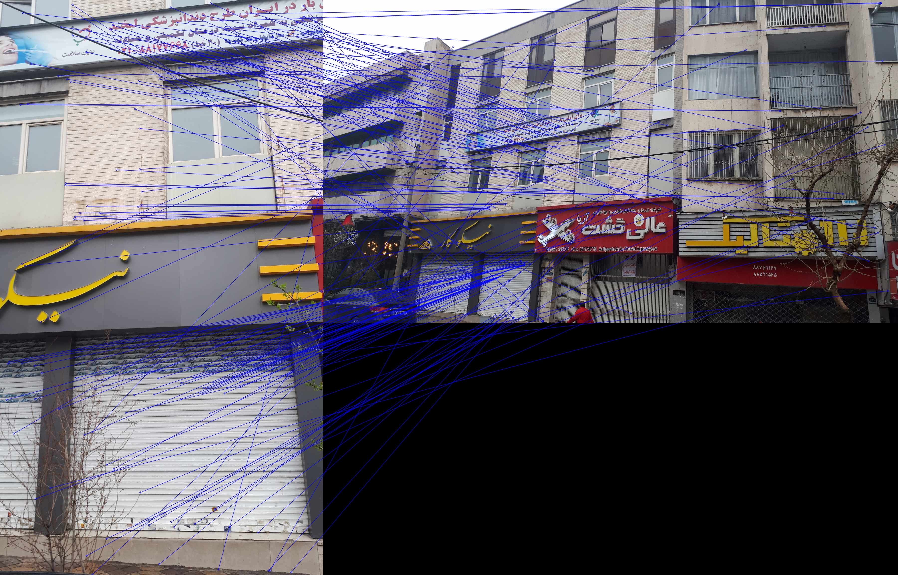

# Perspective-Matching

In this assignment in a sequence of steps we estimate the homography transformation that matches the perspective of one image with another and then apply this transformation.

